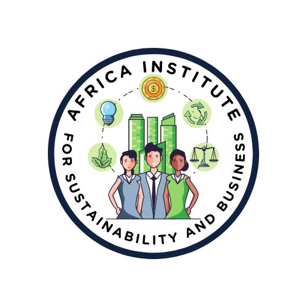

## Website Planning for Africa Institute for Sustainability and Business (AISB)

    

**1. Introduction**
   - **Purpose**: To create a comprehensive plan for the AISB website to effectively communicate its mission, services, and expertise.
   - **Goals**: Enhance online presence, attract stakeholders, and provide a platform for information dissemination and engagement.

**2. Website Objectives**
   - Communicate AISB's mission, vision, and values.
   - Highlight services and expertise in sustainability, training, and consulting.
   - Showcase events, research, and publications.
   - Facilitate contact and engagement with stakeholders.
   - Provide resources and tools for businesses, governments, and civil society organizations.

**3. Target Audience**
   - Businesses seeking sustainable growth solutions.
   - Government agencies looking for policy analysis and training.
   - Civil society organizations interested in sustainability initiatives.
   - Researchers and academics focusing on sustainable development.
   - Entrepreneurs and innovators in Africa.

**4. Website Structure**
   - **Homepage**
     - Mission statement
     - Overview of services
     - Latest news and events
     - Quick links to key sections

   - **About Us**
     - Mission, vision, and values
     - Team profiles (with images)
     - Organizational history and milestones

   - **Services**
     - Sustainability Research and Policy Analysis
     - Capacity Building and Training Programs
     - Consulting Services
     - Event Management and Conference Organization

   - **Expertise**
     - Detailed description of AISB’s areas of expertise
     - Case studies and success stories
     - Testimonials from clients and partners

   - **Research and Publications**
     - Access to research papers and policy analysis
     - Training materials and resources
     - Annual reports and impact assessments

   - **Events**
     - Upcoming conferences, workshops, and seminars
     - Event registration and schedules
     - Highlights from past events

   - **Partnerships**
     - Collaborations with local and international organizations
     - Information on partnership opportunities
     - Current projects and initiatives

   - **Contact Us**
     - Contact information for both Midrand and Harare offices
     - Online contact form
     - Social media links (Facebook, LinkedIn, Instagram)
     - WhatsApp chat link

**5. Design and Branding**
   - **Color Scheme**: Blue, green, silver, gold, grey, and white.
   - **Logo**: Incorporate elements reflecting sustainability and business excellence.
   - **Layout**: Clean, professional, and user-friendly with intuitive navigation.
   - **Typography**: Clear and readable fonts that align with the brand identity.
   - **Images**: High-quality images of the team, events, and projects.

**6. Functionality**
   - **Responsive Design**: Ensure the website is accessible on all devices.
   - **Content Management System (CMS)**: Use a robust CMS for easy content updates.
   - **Search Functionality**: Enable users to quickly find information.
   - **Newsletter Signup**: Allow users to subscribe for updates.
   - **Social Media Integration**: Embed social media feeds and sharing options.
   - **SEO Optimization**: Implement SEO best practices to improve search engine ranking.

**7. Content Strategy**
   - **Regular Updates**: Keep the website current with the latest news, events, and research.
   - **Blog**: Publish articles on sustainability trends, success stories, and insights from experts.
   - **Multimedia**: Use videos, infographics, and images to engage visitors.
   - **Downloads**: Provide downloadable resources such as reports and training materials.

**8. Technical Requirements**
   - **Hosting**: Reliable and scalable hosting solution.
   - **Security**: Implement security measures to protect data and user information.
   - **Analytics**: Use tools like Google Analytics to track website performance and user behavior.

**9. Contact Information**
   - **Email**: info@aisb.org
   - **Phone**: 
     - Midrand: 068 118 9392, 073 617 5752, 067 225 1806
     - Harare: 0773 137 283, 0732 137 283, 0781 137 283
   - **Address**: 
     - Midrand Office: 55 Richards Drive, Halfway House, Midrand 1685, Gauteng
     - Harare Office: 8th floor Pegasus House, Samora Machel Ave., Harare

**10. Next Steps**
   - **Domain Registration**: Register a .org domain for AISB.
   - **Design Mockups**: Create design mockups and gather feedback.
   - **Development**: Begin website development based on the approved plan.
   - **Testing**: Conduct thorough testing to ensure functionality and responsiveness.
   - **Launch**: Officially launch the website and promote it through various channels.
  
Used under the CCA 3.0 license.
